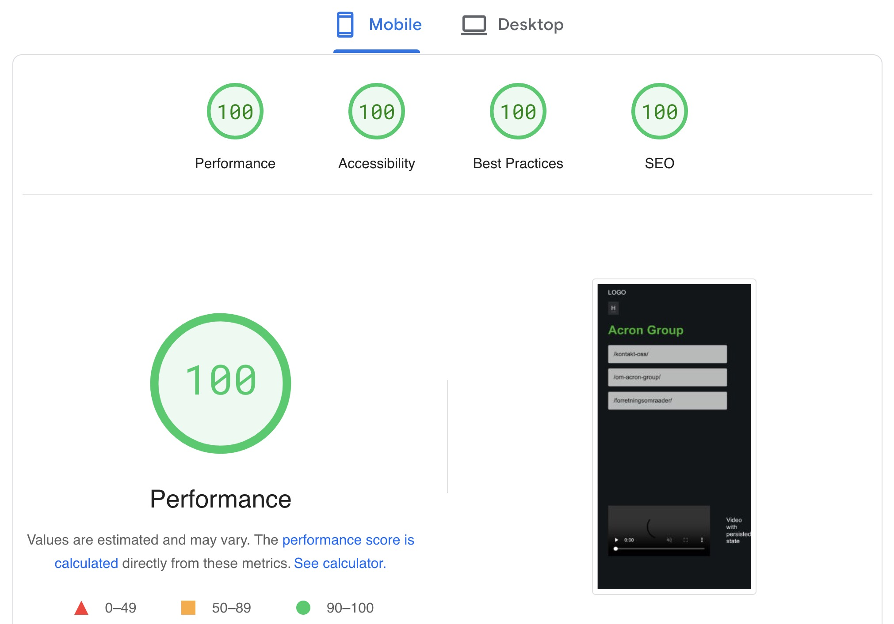

## 🚀Steps

0. Add [Cloudflare Adapter](https://docs.astro.build/en/guides/integrations-guide/cloudflare/) (IF SSR)
```
npx astro add cloudflare
```

2. [Remember to change .env variables!](./.env)
3. [Add repo to Cloudflare pages](https://dash.cloudflare.com/781f2601c68594125b6b97567364d0d6/pages/new/provider/github)
4. [Add webhook from Cloudflare to Umbraco 13 webhooks](https://docs.umbraco.com/umbraco-cms/reference/webhooks)
5. Remember to change "site" variable in [astro.config.mjs](./astro.config.mjs) for correct sitemap and robots.txt generation on build



## 🚀 Project Structure

Inside of your Astro project, you'll see the following folders and files:

```text
/
├── public/
├── src/
│   └── pages/
│       └── index.astro
└── package.json
```

Astro looks for `.astro` or `.md` files in the `src/pages/` directory. Each page is exposed as a route based on its file name.

There's nothing special about `src/components/`, but that's where we like to put any Astro/React/Vue/Svelte/Preact components.

Any static assets, like images, can be placed in the `public/` directory.

## 🧞 Commands

All commands are run from the root of the project, from a terminal:

| Command                   | Action                                           |
| :------------------------ | :----------------------------------------------- |
| `npm install`             | Installs dependencies                            |
| `npm run dev`             | Starts local dev server at `localhost:4321`      |
| `npm run build`           | Build your production site to `./dist/`          |
| `npm run preview`         | Preview your build locally, before deploying     |
| `npm run astro ...`       | Run CLI commands like `astro add`, `astro check` |
| `npm run astro -- --help` | Get help using the Astro CLI                     |

## 👀 Want to learn more?

Feel free to check [our documentation](https://docs.astro.build) or jump into our [Discord server](https://astro.build/chat).

# aks_astro-webhooks
